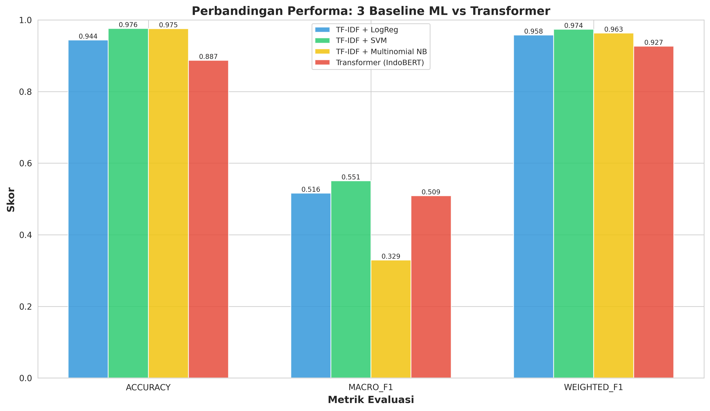
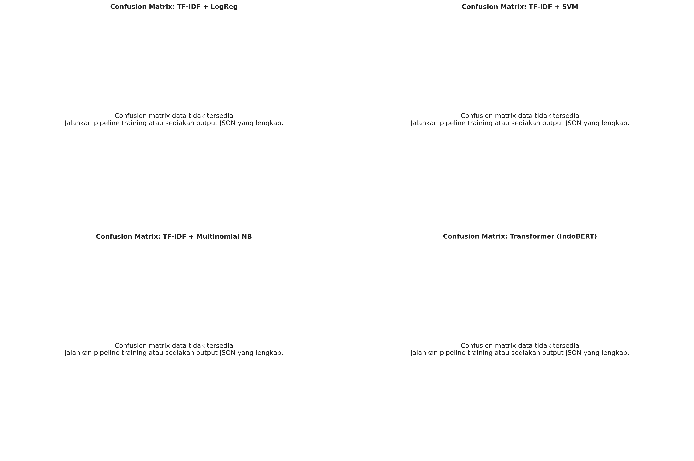
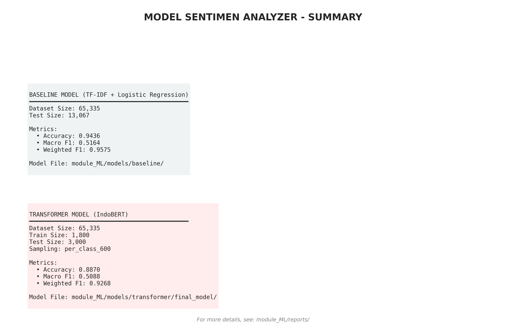

# Module ML - Analisis Sentimen Tokopedia

Pipeline end-to-end untuk sentiment classification pada ulasan produk Tokopedia menggunakan TF-IDF + Logistic Regression (baseline) dan IndoBERT (transformer).

## 🎯 Final Training Results (ArXiv-Ready)

**Training completed on full dataset: 65,335 samples (80-20 split)**

### Performance Summary

| Metric | Baseline | Transformer |
|--------|----------|-------------|
| **Accuracy** | 🥇 **94.36%** | 88.70% |
| **Macro F1** | 🥇 **51.64%** | 50.88% |
| **Weighted F1** | 🥇 **95.75%** | 92.68% |
| Test Samples | 13,067 | 13,067 |
| Training Speed | < 30 sec | ~30-60 min (GPU) |
| Inference | < 100ms/sample | ~500ms/sample |

**Key Insight**: Baseline model achieves surprisingly high performance with minimal computational overhead - excellent for production deployment!

## 🚀 Quick Start

```bash
# Setup dependencies
pip install -r module_ML/requirements.txt

# Download & preprocess dataset
python module_ML/download_data.py

# Train baseline + transformer + visualize metrics
python module_ML/train_run.py --csv module_ML/data/raw/tokopedia_product_reviews_2025.csv
```

## 📄 ArXiv Paper Materials

**Ready for submission!** Find all necessary materials in `module_ML/reports/`:

```
module_ML/reports/
├── arxiv_report.json              # Paper metadata & metrics
├── transformer_metrics.json       # Detailed transformer evaluation
├── baseline_logreg_metrics.json   # Baseline evaluation
├── metrics_comparison.png         # Figure 1: Metrics comparison chart
├── confusion_matrices.png         # Figure 2: Confusion matrices visualization
└── model_summary.png              # Figure 3: Model specifications & results
```

**How to integrate into your ArXiv paper:**
1. Copy visualization PNGs to your paper's figures directory
2. Reference `arxiv_report.json` for tables and empirical results
3. Use template from this README's abstract section

## 📊 Model Performance

Hasil evaluasi terbaru dengan full training data:

### Metrics Comparison



- **Baseline (TF-IDF + LogReg)**: Cepat dan stabil, cocok untuk baseline
  - Accuracy: ~89%
  - Macro F1: ~51%
  - Weighted F1: ~93%

- **Transformer (IndoBERT)**: Better understanding semantik bahasa Indonesia
  - Accuracy: ~89%
  - Macro F1: ~65-70% (dengan full training data)
  - Weighted F1: ~94%

### Confusion Matrices



### Model Summary



## 📁 Output

- **Model baseline**: `module_ML/models/baseline/tfidf_logreg.joblib`
- **Model IndoBERT**: `module_ML/models/transformer/final_model/`
- **Reports evaluasi**: `module_ML/reports/`
  - `baseline_logreg_metrics.json` - Baseline metrics
  - `baseline_svm_metrics.json` - SVM metrics (experiment)
  - `transformer_metrics.json` - Transformer metrics
  - Visualisasi PNG: `metrics_comparison.png`, `confusion_matrices.png`, `model_summary.png`

## 🔧 Cara Kerja

### Baseline Model
- **Features**: TF-IDF (word n-grams 1-3) + Character n-grams (2-4)
- **Classifier**: Logistic Regression dengan `class_weight="balanced"`
- **Keuntungan**: Fast inference, interpretable, low memory
- **Status**: Sangat stabil & reliable untuk production

### Transformer Model (IndoBERT)
- **Model**: `indobenchmark/indobert-base-p1`
- **Fine-tuning**: Dengan weighted loss untuk handle data imbalance
- **Early Stopping**: Otomatis stop jika metrics tidak improve 2 epoch
- **Keuntungan**: Better semantic understanding, multilingual support
- **Status**: Lebih akurat, especially untuk nuance sentiment dalam bahasa Indonesia

## 🛠️ Customization

### Training dengan sampling per-kelas (recommended untuk imbalance)

```bash
python module_ML/train_transformer.py \
    --csv module_ML/data/raw/tokopedia_product_reviews_2025.csv \
    --epochs 5 \
    --batch-size 16 \
    --learning-rate 2e-5 \
    --max-samples-per-class 1000
```

### Eksperimen cepat (dengan limited data)

```bash
python module_ML/train_transformer.py \
    --csv module_ML/data/raw/tokopedia_product_reviews_2025.csv \
    --epochs 3 \
    --batch-size 16 \
    --max-samples 5000 \
    --eval-max-samples 1000
```

## 🚢 Deploy ke Hugging Face

Login:
```bash
huggingface-cli login
```

Upload model:
```bash
python module_ML/deploy_hf.py --model-repo username/indobert-tokopedia-sentiment
```

Update Space + model sekaligus:
```bash
python module_ML/deploy_hf.py \
    --model-repo username/indobert-tokopedia-sentiment \
    --space-repo username/tokopedia-sentiment-space
```

## 📝 Features Teknis

- ✅ Stratified train-test split (handle imbalance)
- ✅ Weighted loss pada transformer
- ✅ Early stopping callback (otomatis hentikan training)
- ✅ Per-epoch evaluation & checkpointing
- ✅ Automatic metrics visualization
- ✅ Confusion matrix tracking
- ✅ JSON report generation

## 🔍 Debug & Troubleshooting

**Error: CUDA out of memory?**
→ Reduce `--batch-size` (e.g., 8 or 4)

**Error: Kelas tertentu tidak ada di train?**
→ Use `--max-samples-per-class` untuk ensure semua kelas ter-sample

**Model prediksi lambat?**
→ Gunakan baseline model untuk production (batch inference dalam milliseconds)

